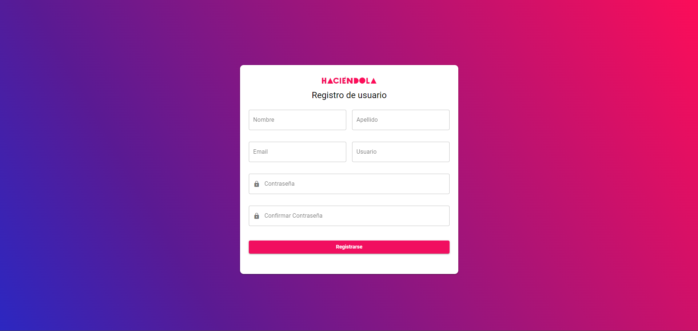
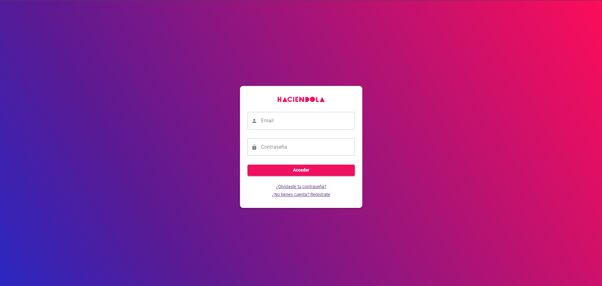

# Haciendola-test (haciendola-front-test)

Este es un proyecto frontend construido con Quasar v2 y Vue 3. El proyecto permite a los usuarios iniciar sesión y administrar productos. Fue creado como parte de un proceso de entrevista y demuestra mi capacidad para construir aplicaciones robustas y escalables con tecnologías modernas.

## Dependencias

Para el correcto funcionamiento de este proyecto será necesario tener levantada la API
https://github.com/Anubis4040/haciendola-back-test

## Teclogias

- Quasar v2
- Vue 3
- Pinia
- npm

## Instalación

Para instalar y ejecutar este proyecto, necesitarás tener instalado Node.js y npm. Luego, sigue estos pasos:

```bash
1. Clonar el repositorio
2. Instala las dependencias: `npm install`
4. Definir las variables de entorno
3. Ejecuta el servidor de desarrollo: `quasar dev`
```

## Uso

Una vez que el servidor esté en funcionamiento, puedes abrir un navegador y navegar a `http://localhost:<puerto especificado>` para ver la aplicación en acción.
Será necesario crear un usuario la primera vez usando el formulario de registro.

Puedes iniciar sesión con las credenciales del nuevo usuario creado y comenzar a administrar productos.

